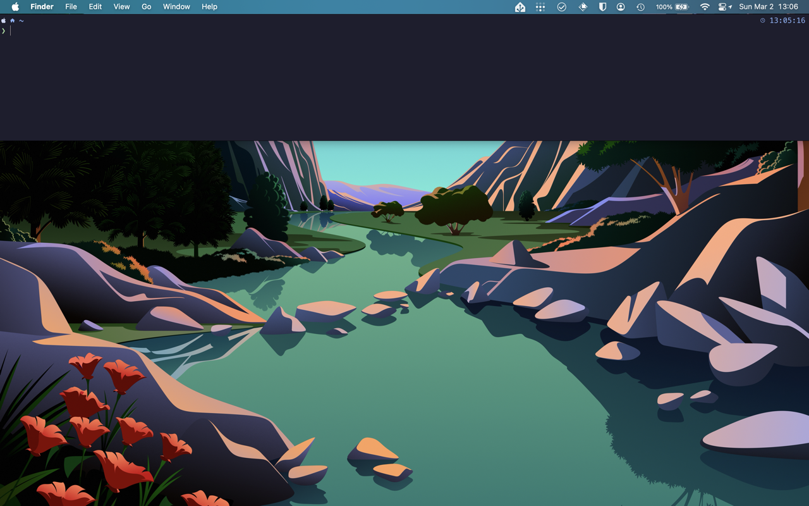

# Terminal & Shell Setup


## Ghostty

I've started using [Mitchell Hashimoto's](https://mitchellh.com/) [Ghostty](https://ghostty.org/), it's fast, clean and runs natively on both macOS and Linux.

> Ghostty is a fast, feature-rich, and cross-platform terminal emulator that uses platform-native UI and GPU acceleration.

### Configuration

```ini
theme = catppuccin-mocha
font-family = "MesloLGM Nerd Font"
keybind = global:cmd+grave_accent=toggle_quick_terminal
```

Ghostty on macOS has a [Quick Terminal](https://ghostty.org/docs/features#macos), I've set a global keybinding of ++cmd+grave-accent++ so I can access it from anywhere.

{ loading=lazy }

### Optional: VS Code Settings

VS Code users will need to add the following to their `settings.json`:

```json
"terminal.external.osxExec": "Ghostty.app",
"terminal.integrated.fontFamily": "MesloLGM Nerd Font",
```

## Z shell (zsh)

Required software:

- [bat](https://github.com/sharkdp/bat)
- [eza](https://github.com/eza-community/eza)
- [fzf](https://github.com/junegunn/fzf)
- [Oh My Posh](https://ohmyposh.dev)

=== ":simple-apple: macOS"

    ```shell
    brew install bat eza fzf jandedobbeleer/oh-my-posh/oh-my-posh
    ```

=== ":simple-linux: Linux"

    Some distros have recent enough versions of `bat`, `eza`, and `fzf`, so you can just use your package manager to install them. For Debian/Ubuntu, I wrote a script to do a system-wide install for you:

    ```shell
    curl -s https://andrew.lecody.com/guides/terminal-and-shell-setup/prep_debian.sh | bash -s
    ```

    The script can be run again to upgrade `bat`, `eza`, and `fzf` to the latest versions. Please note, it has to be run as root and only works on `x86_64`/`amd64` because that's all I needed for now. If you want to improve it, please send me a [pull request](https://github.com/aceat64/website/pulls).

    Next, you'll need to install `oh-my-posh` using their script:

    ```shell
    curl -s https://ohmyposh.dev/install.sh | bash -s
    ```

    This script can also be run again for upgrades.

!!! note

    Ghostty has [Nerd Fonts](https://www.nerdfonts.com/) built-in, so if you use another terminal emulator you will need to install the `Meslo` font yourself.

### Automatic Install

```shell
curl -s https://andrew.lecody.com/guides/terminal-and-shell-setup/install.sh | bash -s
```

### Files

Here are the files, if you just want to look at them instead of running my install script.

??? example "install.sh"

    ```shell
    --8<-- "content/guides/terminal-and-shell-setup/install.sh"
    ```

??? example "prep_debian.sh"

    ```shell
    --8<-- "content/guides/terminal-and-shell-setup/prep_debian.sh"
    ```

??? example "zshrc"

    ```shell
    --8<-- "content/guides/terminal-and-shell-setup/zshrc"
    ```

??? example "acecat Oh-My-Posh Theme"

    ```shell
    --8<-- "content/guides/terminal-and-shell-setup/acecat.omp.toml"
    ```

### Finishing Touches

To use delta with git, update your `~/.gitconfig` with the following:

```toml
[interactive]
    diffFilter = delta --color-only
[include]
    path = ~/.local/share/themes/catppuccin.gitconfig
[delta]
    features = catppuccin-mocha
    side-by-side = true
    navigate = true    # use n and N to move between diff sections
    dark = true
[merge]
    conflictstyle = zdiff3
[diff]
    colorMoved = default
```
