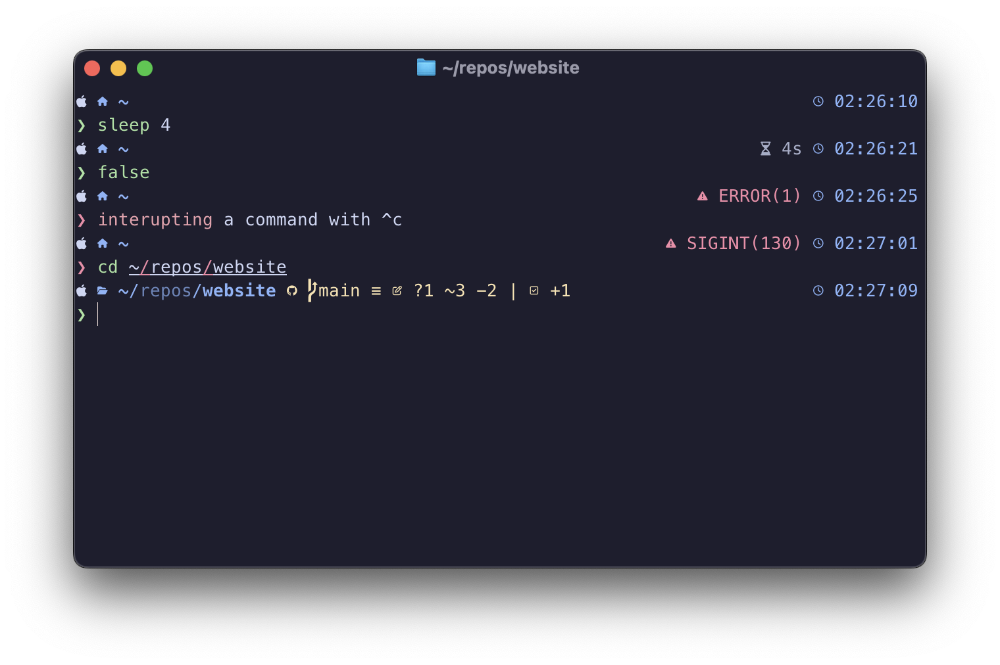
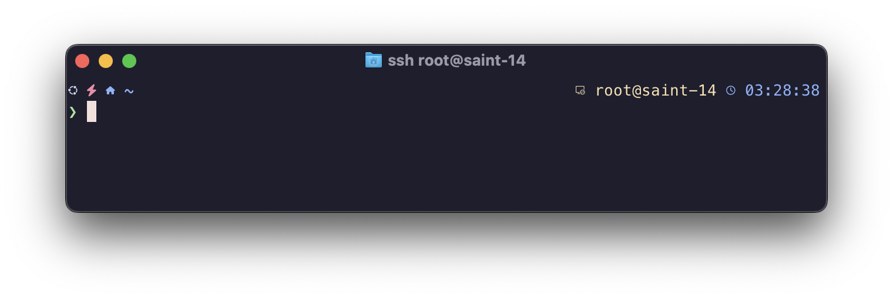

# Terminal & Shell Setup




## Ghostty

I've started using [Mitchell Hashimoto's](https://mitchellh.com/) [Ghostty](https://ghostty.org/), it's fast, clean and runs natively on both macOS and Linux.

> Ghostty is a fast, feature-rich, and cross-platform terminal emulator that uses platform-native UI and GPU acceleration.

### Configuration

```ini
theme = catppuccin-mocha
font-family = "MesloLGM Nerd Font Mono"
```

!!! note

    Ghostty has [Nerd Fonts](https://www.nerdfonts.com/) built-in, so if you use another terminal emulator you will need to install the `Meslo` font yourself.

### Optional: VS Code Settings

VS Code users will need to add the following to their `settings.json`:

```json
"terminal.external.osxExec": "Ghostty.app",
"terminal.integrated.fontFamily": "MesloLGM Nerd Font Mono",
```

## Z shell (zsh)

Required software:

- [Oh My Posh](https://ohmyposh.dev)
- [zsh-syntax-highlighting](https://github.com/zsh-users/zsh-syntax-highlighting)
- [zsh-autosuggestions](https://github.com/zsh-users/zsh-autosuggestions)
- [eza](https://github.com/eza-community/eza)
- [bat](https://github.com/sharkdp/bat)
- [fzf](https://github.com/junegunn/fzf)

### Files

??? example "zshrc"

    ```shell
    --8<-- "content/guides/terminal-and-shell-setup/zshrc"
    ```

??? example "acecat Oh-My-Posh Theme"

    ```shell
    --8<-- "content/guides/terminal-and-shell-setup/acecat.omp.toml"
    ```

### Theme Installer

```shell
echo "Downloading acecat theme for oh-my-posh"
mkdir -p ~/.config/ohmyposh
wget -q -P ~/.config/ohmyposh https://lickthesalt.com/guides/terminal-and-shell-setup/acecat.omp.toml

echo "Installing bat theme"
mkdir -p "$(bat --config-dir)/themes"
wget -q -P "$(bat --config-dir)/themes" https://github.com/catppuccin/bat/raw/main/themes/Catppuccin%20Mocha.tmTheme
bat cache --build

echo "Install zsh-syntax-highlighting theme"
mkdir -p ~/.config/catppuccin
wget -q -P ~/.config/catppuccin https://github.com/catppuccin/zsh-syntax-highlighting/raw/main/themes/catppuccin_mocha-zsh-syntax-highlighting.zsh
```
